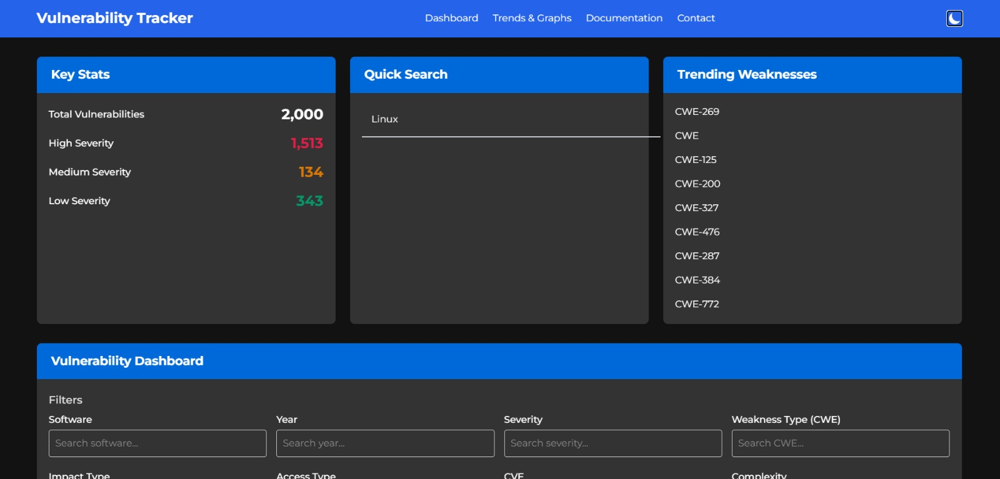
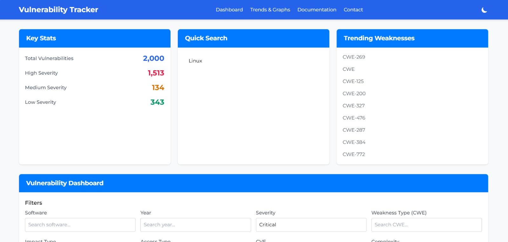
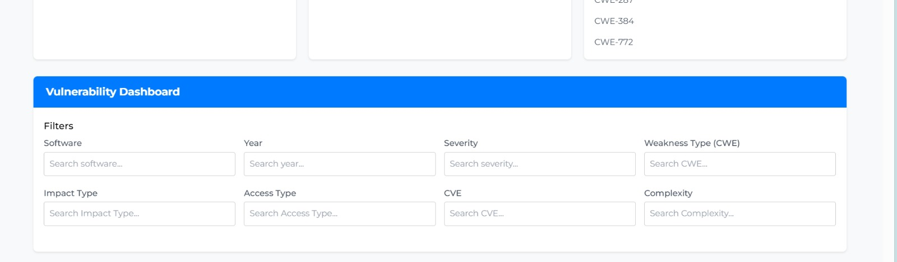
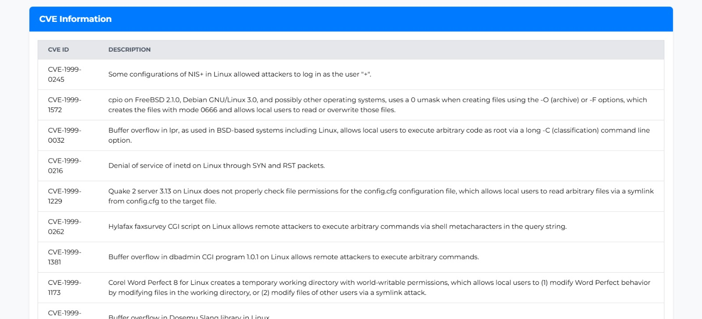
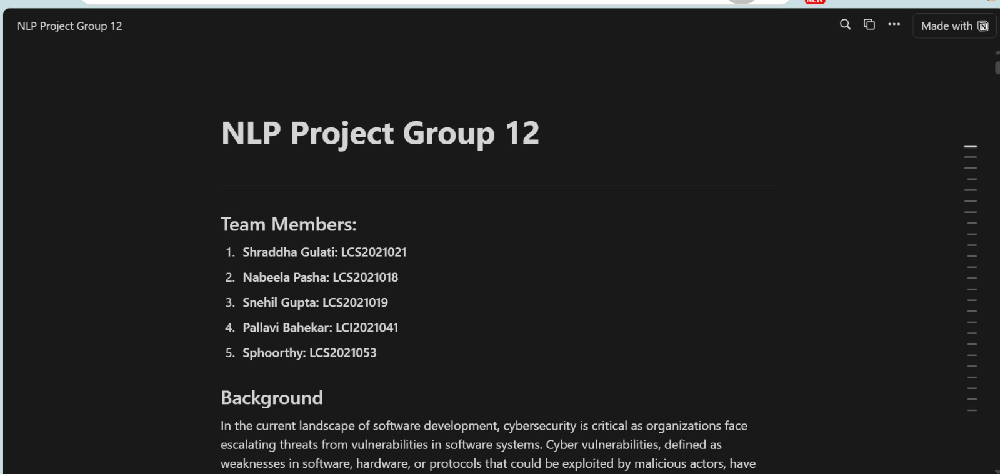

# NLP Project Group 12: Vulnerability Dashboard

## Team Members
1. **Shraddha Gulati**: LCS2021021
2. **Nabeela Pasha**: LCS2021018
3. **Snehil Gupta**: LCS2021019
4. **Pallavi Bahekar**: LCI2021041
5. **Sphoorthy**: LCS2021053

---

## Project Overview

In today’s world of rapid digitalization, cybersecurity threats are on the rise, with vulnerabilities in software, hardware, and protocols posing critical risks. The National Vulnerability Database (NVD) provides essential data to combat these risks, but the large volume of information can be overwhelming. To make this data accessible and actionable for cybersecurity professionals, our **Vulnerability Dashboard** aggregates NVD data, providing categorized insights, severity analysis, and real-time notifications to facilitate faster, more informed responses to vulnerabilities.

## Problem Statement

Cybersecurity analysts often face challenges in accessing and prioritizing vulnerability data effectively:
1. **Data Overload**: Hundreds of thousands of entries in the NVD database make it challenging to pinpoint relevant vulnerabilities quickly.
2. **Limited Customization**: Analysts need better tools to filter vulnerabilities by software type, severity, impact, etc., to target their security measures efficiently.
3. **Difficulty in Prioritization**: Lack of systematic ranking impedes the focus on high-severity vulnerabilities, delaying crucial responses.
4. **Communication Gaps**: Real-time notifications and alerts are limited, affecting the immediacy of responses to critical vulnerabilities.

Our **Vulnerability Dashboard** addresses these issues by enabling advanced search, filtering, and severity-based prioritization, making it easier for organizations to manage cyber threats effectively.

---

## Objectives

Our goal is to develop a centralized dashboard that empowers cybersecurity teams to access, analyze, and manage vulnerability data efficiently. The main objectives are:

1. **Data Retrieval and Display**: Retrieve NVD data through an API and present it in an intuitive, categorized format.
2. **Advanced Filtering**: Allow users to search vulnerabilities based on various criteria such as severity, software type, impact, etc.
3. **Prioritization**: Implement ranking based on severity score (CVSS) and impact to help prioritize vulnerabilities.
4. **Real-Time Communication**: Send notifications via email to alert teams of critical vulnerabilities.
5. **Automated Data Storage**: Store vulnerability data in a database for easy access and regular updates.
6. **User-Friendly Interface**: Design an accessible and visually appealing UI to aid cybersecurity analysts.
7. **Enhanced Decision-Making**: Facilitate better decision-making by clearly presenting actionable data.

---

## Project Setup

To get started with this project, follow these steps:

### Step 1: Clone the Repository

Clone the project repository to your local environment.
```bash
git clone https://github.com/gshraddha17/NVD_CVE_Project.git
cd <repository-folder>
```

### Step 2: Run the Colab File

Run the following Colab file, which includes the code and necessary dependencies:
[Colab File](https://colab.research.google.com/drive/1f-3nWuHuMawK4fdVHRu5lOHX5rgoeQBy?usp=sharing)

All required dependencies are installed automatically using `pip` within the Colab environment.

### Step 3: Generate JSON Files

The Colab file will generate JSON files with the processed NVD data. Download these files and store them in the designated folder on your local environment.

> **Note:** The JSON files are only needed when working with a new API data set. Otherwise, you can simply access the website from the main link without regenerating the data: [Dashboard](https://gshraddha17.github.io/NVD_CVE_Project/)

### Step 4: Access the Website

Once the JSON files are available in the designated directory, the HTML, CSS, and JavaScript code will automatically fetch and display the data. Open the main link to access the vulnerability dashboard.

---
## Tools and Features Overview

1. **Count of Critical Levels**:  
   This tool extracts and displays the count of vulnerabilities categorized by their critical levels (e.g., High, Medium, Low) based on data fetched via the API. It helps in quickly assessing the severity distribution across the dataset.

2. **Trending Weaknesses**:  
   A set of trending weakness types is displayed, showing which weaknesses are frequently occurring in recent vulnerabilities. This helps analysts stay updated on the most common and pressing issues in the cybersecurity landscape.

3. **Quick Search**:  
   The Quick Search feature allows users to search for vulnerabilities using any keyword. It works not only with keywords but also integrates with the dropdown filters, enabling seamless and customizable searches.

4. **Software-Specific Vulnerabilities**:  
   - **Search by Software**: Users can select or type the name of a software (e.g., Microsoft Windows, Apache) and view all related vulnerabilities (CVEs and their descriptions) associated with that software.

5. **Weakness Type**:  
   - **Search by Weakness Type**: Users can filter vulnerabilities based on weakness types (e.g., buffer overflow, SQL injection) to narrow down the results.

6. **Access Complexity**:  
   - **Filter by Access Complexity**: This dropdown allows users to view vulnerabilities categorized by their access complexity (e.g., low, medium, high), helping prioritize based on exploitability.

7. **Access Vector**:  
   - **Filter by Access Vector**: This option filters vulnerabilities based on how they can be exploited (e.g., network, local, adjacent network).

8. **Critical Level**:  
   - **Filter by Critical Level**: Users can select the severity level of vulnerabilities they want to focus on, such as "Critical," "High," or "Medium."

9. **Year**:  
   - **Search by Year**: Users can filter vulnerabilities based on the year of disclosure, making it easier to track recent or historical issues.

10. **Impact Type**:  
   - **Filter by Impact Type**: This filter allows users to search vulnerabilities based on their impact (e.g., confidentiality, integrity, availability), offering a clearer view of the most relevant threats.

11. **Find Similar Vulnerabilities by CVE ID**:  
   - **Similar Vulnerability Search**: Users can type in a CVE ID and find vulnerabilities that are similar to it, facilitating a deeper investigation of related threats.

12. **Documentation**:  
   - **Access Documentation**: Users can view comprehensive documentation for the project by clicking on the "Documentation" section, providing details on the project's setup, usage, and features.

---

## Screenshots

### Dashboard Overview



### Filtering Features


### Table


### Documentation



